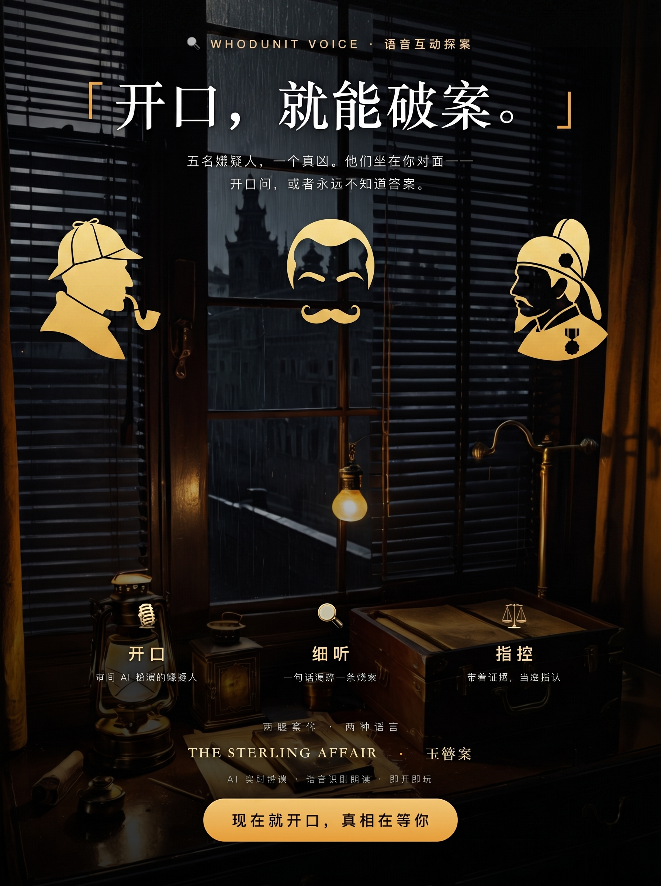

# Whodunit Voice - 语音互动探案

<p align="center">
  
</p>

一个浏览器端的**语音驱动互动谋杀推理游戏**：用声音（或打字）审问嫌疑人，
收集证据，指控真凶。嫌疑人由 DeepSeek V4 Flash 实时扮演，法官由同一模型判定指控。
案件与全部数据为虚构（fake data）。

## 快速开始

```bash
cd /Users/william.jiang/my-tests/my-fun/whodunit-voice
cp .env.example .env        # 填入 DEEPSEEK_API_KEY（可选：DASHSCOPE_API_KEY 启用多音色配音）
node server.js              # Node >= 18，零依赖，无需 npm install（存档功能需 Node >= 22.5）
```

打开 http://127.0.0.1:4310 ，选择一个案件开始。

> 🎙️ **多角色智能配音**：15 名嫌疑人各配独立音色——男角色男声、女角色女声，
> 并按年龄/性格微调语速与音调；法官、简报旁白也各有专属声音。
> 音色源自动选择：阿里云 Sambert（可选 Key）→ **微软 Edge TTS（免费，322+ 音色，无需 Key）**
> → 浏览器语音兜底。零配置也能立即听到多角色声音。

## 内置案件

| 案件 | 语言 | 概要 |
|---|---|---|
| The Sterling Affair | English | 科技富豪 Victor Sterling 死于书房，5 名嫌疑人，真凶 CFO Marcus Chen |
| 玉簪案 | 中文 | 临安绸缎庄东家赵文远被砒霜毒杀，5 名嫌疑人，真凶账房钱伯年 |
| The Midnight Meridian | English | 1927 年豪华列车密室命案：魔术师 Aldous Vance 被刺死在锁死的包厢里，5 名嫌疑人，真凶对手魔术师 Sebastian Croft |
| 灯影幻戏（Kimi K3 生成） | 中文 | 唐·长安上元灯节，戏法大师死在从内反锁的戏箱里；真凶利用"箱中换人"的障眼法 |
| 白牡丹（Kimi K3 生成） | 中文 | 1935 上海大光明戏院，头牌名伶死在反锁的化妆间；死亡时间被"谢幕"误导 |
| The Halcyon Voyage（Kimi K3 生成） | English | 世代飞船 Halcyon 的冷冻舱密室：建筑师死于密封低温舱，AI 日志被伪造 |

UI、语音识别与朗读语言自动跟随案件语言（en-US / zh-CN）。

## 玩法

1. 选择案件，阅读简报与时间线，接案。
2. 阅读**案发现场**与**人物关系图**（受害者居中、嫌疑人环绕的关系网），再接案。
3. 选择嫌疑人审问。点 🎤 说话（Chrome/Edge/Safari），或直接打字，也可以用**推荐提问**一键发问。
4. 观察嫌疑人头顶的**情绪徽章**（镇定/不安/急躁/破绽毕露）与其**小动作**——压力越大，破绽越多。
5. 提问命中隐藏关键词会解锁线索（+20 分/条），自动进入证据板（按“案发现场/嫌疑人”分组）。
6. 卡住时可在证据板点 💡 **提示**（每条 −5 分，每案 3 次）。
7. 掌握证据后点 ⚖️ Accuse：选嫌疑人、填动机、勾选引用的证据。
8. 法官给出判定、评分、**关键证据反馈**、**成就**与**结案复盘**（漏掉的线索+提示）。

进度自动保存在服务端 SQLite（Node 内置 node:sqlite）：刷新或关页后，案件卡片会显示 ▶ 继续，简报页可一键续玩；多案进度互不覆盖。
最佳得分按案件记录（服务端），展示在案件卡片与判决页。

### 声音玩法

- **多音色审问**：进入审问后，嫌疑人头部显示音色标签（如 🎙 磁性男声 ♂）。
  每句回复用该嫌疑人自己的声音朗读（服务端 Sambert 合成，Web Audio 播放）。
- **免费音色源**：未配置阿里云 Key 时自动使用微软 Edge TTS（322+ 免费音色），
  同一套嫌疑人音色人设自动映射到 Edge 音色（晓晓/云健/云希/Aria/Brian……）。
- **法官宣判**：指控提交后，判决陈词由威严的法官音色朗读。
- **听案件简报**：简报页新增「🔊 听案件简报」按钮，旁白音色朗读案情与案发现场。
- **状态指示**：合成/播放期间，输入框下方显示「正在合成语音…… · 音色名」。
- **语音提问**：点 🎤 说话（Chrome/Edge/Safari），或打字；回复朗读可用工具栏 🔊 开关关闭。
- **人物画像**：每名嫌疑人都有专属头像（卡片/审问页）与表情肖像——审问中情绪
  镇定/不安/破绽毕露时，肖像随之切换；图像由本地 ComfyUI 生成（见
  [comfyui/README.md](comfyui/README.md)），生图即上线，缺失时自动回退 emoji。

## 架构

```
浏览器 (语音识别/合成 + i18n UI)
   └─ fetch → Node 零依赖服务器 (server.js)
                 ├─ DeepSeek API (deepseek-v4-flash)   角色扮演 + 法官判定
                 ├─ Edge TTS (WebSocket, 免费)          多音色语音合成（默认）
                 └─ DashScope Sambert (WebSocket TTS)   高音质多音色（可选 Key）
```

- 案件包：`data/cases/<caseId>/`（case.json / suspects.json / clues.json，可插拔）
- 后端：`server.js`（静态服务 + /api/cases + /api/case + /api/chat + /api/accuse + /api/tts + /api/tts/voices + /api/health + 用户数据 /api/session、/api/player、/api/state、/api/leaderboard）
- 前端：`public/index.html`、`public/styles.css`、`public/app.js`（含 I18N 字典）
- 人物图像：`public/characters/<caseId>/<charId>_<variant>.png`；工作流与生成器在 `comfyui/`

## 关键设计

- **API key 安全**：DeepSeek key 只存在服务端 `.env`，前端通过同源 API 代理调用。
- **多音色配音**：嫌疑人音色/语速/音调写在 `suspects.json`，`/api/case` 只透传音色信息（不含 secret/guilt）。
- **真相防作弊**：凶手/动机只存服务端，`/api/case` 不下发 solution/guilt/secret。
- **多案件可插拔**：新增案件 = 新建 `data/cases/<id>/` 三个 JSON，无需改代码。
- **线索确定性**：线索解锁是关键词规则匹配，不依赖 LLM，行为可预期。
- **LLM 角色约束**：每名嫌疑人带 personality / secret / revealRules，控制隐瞒与崩溃时机。
- **审问状态观察**：嫌疑人回复末尾携带隐藏的舞台提示（mood/tell），服务端解析后用于界面情绪徽章，不影响角色扮演正文。
- **存档续玩**：线索/分数/审问记录/提示次数/情绪状态写入服务端 SQLite（`data/whodunit.db`，Node 内置 node:sqlite，零依赖），随案件自动保存，支持多案并行。
- **零依赖**：Node 18+ 内置 http/fetch 即可运行；用户数据存档需 Node 22.5+（内置 node:sqlite，缺失时相关端点降级 503）。

## 常见问题

- **听不到语音回复**：点 🔊 确认开启；默认走服务端 Edge TTS 多音色（免费最稳），
  想用阿里云 Sambert 再配 `DASHSCOPE_API_KEY`；两者都不可用时才回退浏览器语音。
- **语音识别不工作**：Firefox 不支持 Web Speech 识别，请用 Chrome/Edge/Safari，或直接打字。
- **"证人突然沉默（DeepSeek 不可用）"**：API key 无效、额度不足或网络问题，检查 `.env` 后重试。
- **想重玩**：结局页点"再玩一次"；想换案件点"换个案件"。

## 文档

- [SPEC.md](docs/SPEC.md) - 产品规格、假数据模型、API 契约、版本记录（至 v0.7.2）
- [PLAN.md](docs/PLAN.md) - 实施计划与验证记录
- [resources.md](docs/resources.md) - 运行资源清单
- [comfyui/README.md](comfyui/README.md) - 人物图像生成（动画风模型清单、ComfyUI 工作流）
- [REVIEW.md](docs/REVIEW.md) - 产品与技术评审 + 路线建议（v0.7.2 节点）
- [CASE-PIPELINE-SPEC.md](docs/CASE-PIPELINE-SPEC.md) - 案件制作流水线设计（内容量产）
- [MOBILE-APP-SPEC.md](docs/MOBILE-APP-SPEC.md) / [MOBILE-APP-PLAN.md](docs/MOBILE-APP-PLAN.md) - 手机端（PWA → Capacitor）设计与计划（**已搁置**）

## 安全提示

- `.env` 已 gitignore，不要提交真实 API key。
- 语音数据不会离开浏览器（识别在本地进行）。
